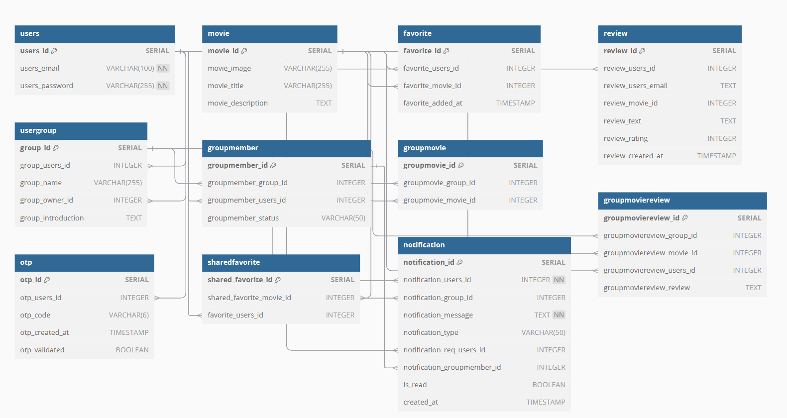

# Movie Application 🎥


## 📖 Overview
Discover movies with detailed info, and ratings. Share your thoughts, rate films, and connect with fellow fans in interactive groups. Use filters to explore new titles, create favorite lists, and personalize your cinema experience. Perfect for every movie lover, this app brings everything you need for a seamless and fun movie journey!

## ⚡ Technologies
- `ReactJs`
- `NodeJs`
- `JavaScript`
- `PostgreSQL`
- `CSS / SCSS`
- `Docker`

## 🧑‍🤝‍🧑 Team Members
- [Mostafa Trahim]() : Scrum Master | FrontEnd Development
- [Erik Markula]() : BackEnd Development | DevOps
- [Xuanyu Liu]() : BackEnd Development
- [Zhiying Huang]() : FrontEnd Development | UI/UX Design
- [Bao Nguyen]() : FrontEnd Development
- [Bibek Tondon]() : BackEnd Development

## 🌟 Features

- **🔐 User Authentication**: Users can sign up and login to the application.
- **🎬 Movies Browsing**: Users can browse and Movies with detailed information
- **🔍 Search**: Users can search for movies.
- **✍🏻 Reviews**: Users can rate and review movies.
- **👥 Groups**: Users can create and join groups.
- **❤️ Favorites**: Users can add movies to their favorites list.
- **☰ Filters**: Users can filter movies by genre, rating, and more.
- **🎨 Responsive Design**: The application is fully responsive and works on all devices.


<!-- ## 💭 Process -->

## 🏗️ Application Architecture

**⚛️ FrontEnd:** Developed using React.js, focusing on a responsive and intuitive interface. State is currently managed using React's useState and useEffect.
**⚙️ BackEnd** Implements a RESTful API architecture using Node.js and Express, ensuring modular and maintainable code.
**🛢 Database** The PostgreSQL schema is normalized, allowing for efficient storage and retrieval of movie-related data.
<!-- **🐳 Deployment** The application is containerized using Docker, ensuring seamless deployment and scaling. -->

## 📄 API Documentation

The REST API documentation is available in the server folder, inside the *client.rest* file. This file contains all the necessary endpoints and their methods.

## 📚 Database Schema

The PostgreSQL database schema consists of the following tables:



## 🎨 UI Design
The figma link for UI wireframe and pages layout:
https://www.figma.com/design/MDSTBxhqlFrHQ6SiiiHXxm/Movie-App?node-id=8-6&node-type=canvas&t=F5E6Sr74waIKYnuX-0

## 💭 How can it be improved?

- **🔍 Search**: Implement a more advanced search feature, allowing users to search by actor, director, and more.
- **🎬 Recommendations**: Implement a recommendation system based on user preferences and viewing history.
- **🎨 Design**: Improve the UI/UX design, focusing on a more modern and visually appealing interface.
- **🔐 Security**: Implement additional security features, such as two-factor authentication and encryption.
- **🤝 Integration**: Integrate with other platforms, such as social media and streaming services.
- **📝 Reviews**: Implement a more advanced review system, allowing users to rate movies based on different criteria.
- **🌙 Dark Mode**: Implement a dark mode feature, allowing users to switch between light and dark themes.


## 🚦 Running the Project
To run the project in your local environment, follow these steps:

1. 🧬 Clone the repository
    ```sh
    git clone https://github.com/Group-12-Org/Movie-App.git
    ```
2. 📂 Navigate to the project directory and Install required dependencies using 
    ```sh
    npm install
    ```
    or 
    ```sh
    yarn
    ```
3. 🔑 Set up the environment variables required for API keys and database configuration.
4. 🗄️ Initialize the PostgreSQL database.
5. 🚀 Run the development server by navigating to the server directory and using 
    ``` sh
    npm run devStart
    ```
    or 
    ``` sh
    yarn dev
    ```
   
6. Run the application using
    ``` sh
    npm start
    ```
7. Open `http://localhost:3000` to view the application.


## Testing the Project

To start docker container use
```sh
docker compose up -d
```
To run the tests, use the following commands:
```sh
npm testStart
```
and 
```sh
npm run test
```

## 🎥 Demo/Preview
View the working live demo here: [Movie application](https://purple-meadow-09333ff03.4.azurestaticapps.net/)

## 📝 License
This project is licensed under the MIT License. See the [LICENSE](./LICENSE) file for more information.
